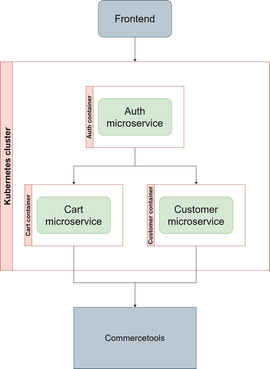
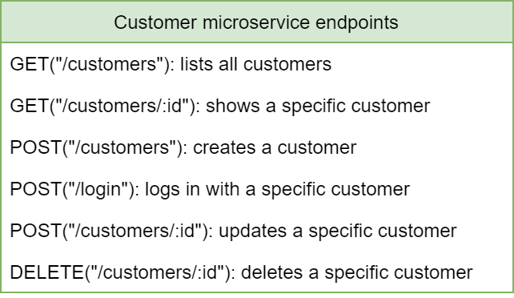
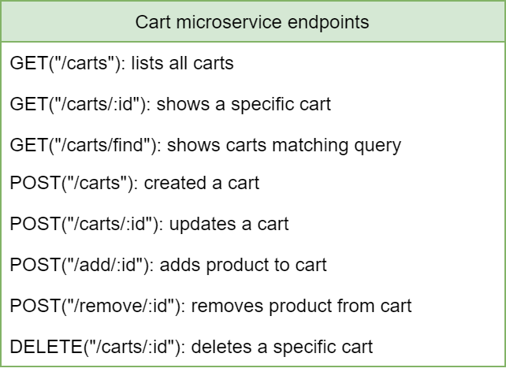
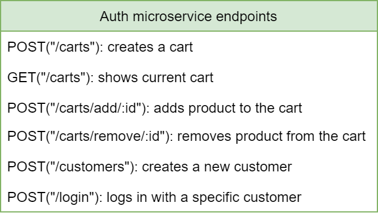
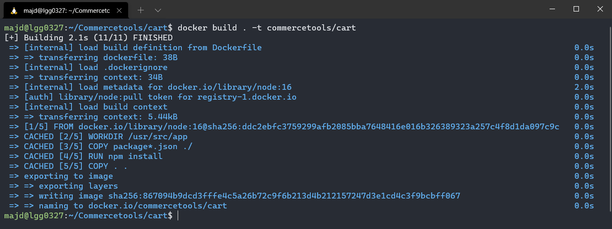
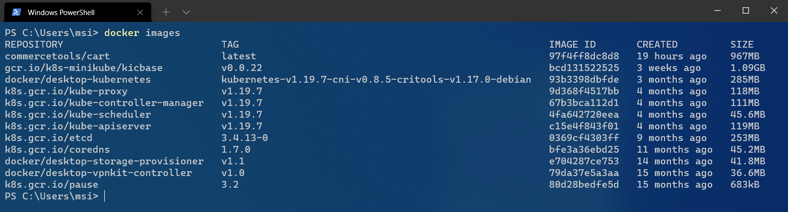
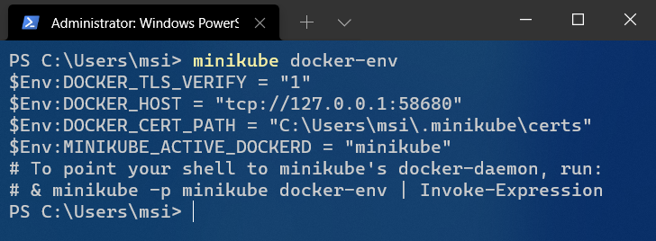
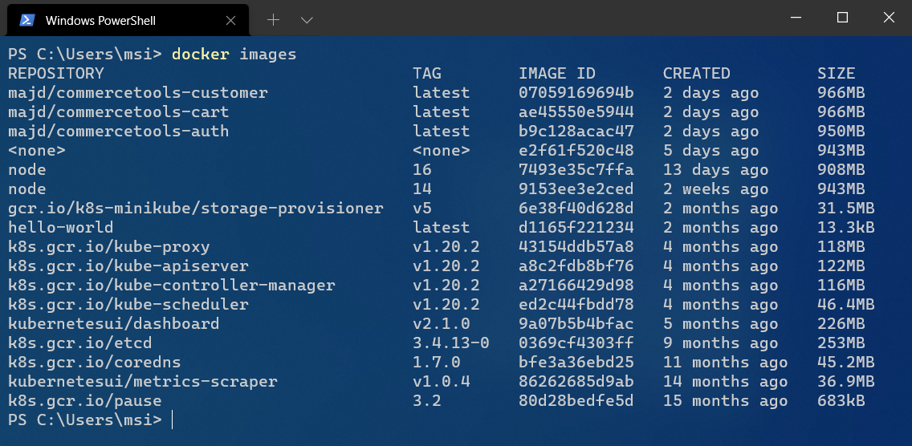
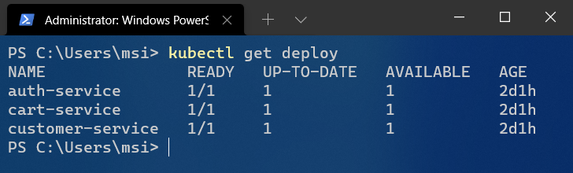
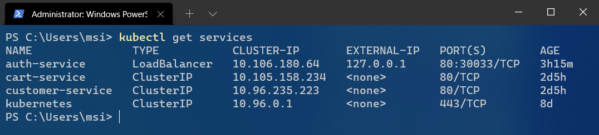

# Table of contents: <!-- omit in toc -->
- [1. Introduction.](#1-introduction)
- [2. Creating Docker images from the microservices.](#2-creating-docker-images-from-the-microservices)
  - [2.1 Preparing the *`.dockerignore`* file.](#21-preparing-the-dockerignore-file)
  - [2.2 Preparing the *`Dockerfile`* file.](#22-preparing-the-dockerfile-file)
  - [2.3 Building the image.](#23-building-the-image)
- [3. Adding images to minikube's registry.](#3-adding-images-to-minikubes-registry)
- [4. Creating and deploying pods from images using minikube.](#4-creating-and-deploying-pods-from-images-using-minikube)
- [5. Creating services using minikube.](#5-creating-services-using-minikube)
- [6. Other useful tools.](#6-other-useful-tools)
  - [6.1 K9s.](#61-k9s)
  - [6.2 Octant.](#62-octant)
# 1. Introduction.  
This guide contains basic instructions on how to build Node Docker images and use minikube to build and manage a Kubernetes cluster.  
This guide assumes little to no prior knowledge using Docker, Kubernetes, or minikube. Please keep in mind that I wrote this guide after about one week of using Docker and Kubernetes for the first time. So it might be very basic or badly-written to some or helpful and well-structured to others.
# 2. Creating Docker images from the microservices.
This is a small project that uses the Commercetools HTTP API to create 3 microservices, create a Docker image for each one of those microservices, and then create and manage a Kubernetes cluster with those images using minikube.  
The following diagram shows how those microservices comunicate with each other, with the frontend, and with Commercetools:  
  
Here are all the endpoints of every microservices:  
  
  
  
The microservices and their endpoints are documented on this [Swagger API](https://app.swaggerhub.com/apis/majdsabik/Commercetools/1.0.0 "Commercetools on Swagger").  
## 2.1 Preparing the *`.dockerignore`* file.  
Similar to the *`.gitignore`* file, the *`.dockerignore`* file tells Docker what files and directories to exclude from the image cuilding process. You can read more about it [here](https://docs.docker.com/engine/reference/builder/#dockerignore-file "Dockerfile reference").  

## 2.2 Preparing the *`Dockerfile`* file.  
This is a script that contains a list of commands Docker executes when building an image.  
This is an example of said file:  
```Dockerfile
FROM node:16

# Create app directory
WORKDIR /usr/src/app

# Install app dependencies
# A wildcard is used to ensure both package.json AND package-lock.json are copied
# where available (npm@5+)
COPY package*.json ./

RUN yarn
# If you are building your code for production
# RUN npm ci --only=production

# Bundle app source
COPY . .

EXPOSE 80

CMD [ "node", "app.js" ]
```
The port number used with the *`EXPOSE`* command must match the port at which the Node app runs.  
You can read more about the *`Dockerfile`* [here](https://docs.docker.com/engine/reference/builder/ "Dockerfile reference") and [here](https://www.cloudbees.com/blog/a-beginners-guide-to-the-dockerfile/ "A Beginner's Guide to the Dockerfile").  
## 2.3 Building the image.  
To build a Docker image, navigate with your favorite terminal to the directory containing the *`Dockerfile`* and run the following command:  
```
docker build . -t <commercetools/cart-service>
```
where the *`-t`* option is used to tag the image (more about image tagging [here](https://docs.docker.com/engine/reference/commandline/tag/ "docker tag")). You can read more about the Docker *`build`* command and the options it accepts in the official Docker documentation [here](https://docs.docker.com/engine/reference/commandline/build/ "Docker build").  
The result of the previous command shall look similar to this:  
  
# 3. Adding images to minikube's registry.  
A very important thing to keep in mind - which caused me a lot of confusion at the beginning - is that minikube uses its own registry for storing images. Try the following to see what I mean.  
First, we need to make sure minikube is running by executing the command *`minikube start`*.  
In a terminal of your choice, list Docker images using the command *`docker images`*. The result will look similar to this:  
  
Those are the images stored in Docker registry. We now want to list and manage the images stored in minikube's registry. To do so, run *`minikube docker-env`*. The result will llok similar to this:  
  
What we need to do now is executing the command in the last line to make Docker use minikube's registry. Keep in mind that this command will take effect only on the terminal window/tab used to run it and that the command itself will change according to the type of terminal used to execute the command *`minikube docker-env`* (bash, PowerShell, CMD, etc).   
To make sure the command worked, we run *`docker images`* again:  
  
Notice that the images shown now are different from what was shown when running *`docker images`* the first time. The images shown now are the images we will use in the Kubernetes cluster. Which means we also need to switch to minikube's registry before building an image, otherewise it'll be available only on Docker's registry and not in minikube's.  
# 4. Creating and deploying pods from images using minikube.  
Pods are the smallest, most basic deployable objects in Kubernetes. A Pod represents a single instance of a running process in your cluster. Pods contain one or more containers, such as Docker containers. When a Pod runs multiple containers, the containers are managed as a single entity and share the Pod's resources.  
To create a pod, we create a new *`YAML`* file that looks like this:  
```YAML
apiVersion: apps/v1
kind: Deployment
metadata:
  name: cart-service
  labels:
    app: cart-service
spec:
  replicas: 1
  selector:
    matchLabels:
      app: cart-service
  template:
    metadata:
      labels:
        app: cart-service
    spec:
      restartPolicy: Always
      containers:
      - name: cart-service
        image: docker.io/majd/commercetools-cart:latest
        imagePullPolicy: Never
        ports:
        - containerPort: 80
        resources:
          requests:
            memory: "128Mi"
            cpu: "100m"
          limits:
            memory: "256Mi"
            cpu: "200m"
```
It's important that the name of the image under *`spec -> template -> spec -> containers -> image`* matches the name of the image in minikube's registry. This name can be obtained by running *`minikube image list`*.  
I'm not going to go through what everything is the deployment file means, but you can read more about it [here](https://kubernetes.io/docs/concepts/workloads/controllers/deployment/ "Kubernetes Deployments") and [here](https://www.mirantis.com/blog/introduction-to-yaml-creating-a-kubernetes-deployment/ "Introduction to YAML: Creating a Kubernetes deployment").  
The next step would be deploying this file. This can be done by running this command *`kubectl apply -f <deployment-file.yaml>`*. To check if the deployment was successful we execute the command *``kubectl get deployment`*, the result should be similar to this:  
  
# 5. Creating services using minikube.  
A Kubernetes service is a logical abstraction for a deployed group of pods in a cluster (which all perform the same function). Since pods are ephemeral, a service enables a group of pods to be assigned a name and unique IP address (clusterIP).  
To create a service, we create a new YAML file that looks like this:  
```YAML
apiVersion: v1
kind: Service
metadata:
  name: auth-service
spec:
  selector:
    app: auth-service
  ports:
    - name: http
      protocol: TCP
      port: 80
      targetPort: 80
  type: LoadBalancer
```
The port number used with the *`targetPort`* must match the port at which the Node app runs.  
The next step would be to actually apply this file. This can be done by running this command *`kubectl apply -f <service-file.yaml>`*.  
P.S.: I'm using *`LoadBalancer`* type for the *`auth-service`* because I will need to connect to it from the host. And according to my very limited knowledge in this topic, using a *`LoadBalancer`* gets the job done easily.  
Keep in mind that in order to connect to a service of type *`LoadBalancer`* you need to start the minikube tunnel using the command *`minikube tunnel`*. After doing so, the service will have an IP address that can be used to access it. In our case it will be the localhost, but to be sure execute this command *`kubectl get services`*. The output will be similar to this:  
  
As we can see the service *`auth-service`* can be accessed via *`127.0.0.1:80`*.  
# 6. Other useful tools.  
Kubernetes can be difficult to navigate for learners because it requires memorizing lots of commands. Therefore, there are some tools that help users navigate all aspects of Kubernetes.  
## 6.1 [K9s](https://github.com/derailed/k9s "K9s on GitHub").  
This is a terminal UI tool. It makes it easier to navigate, observe and manage your applications and continually watches Kubernetes for changes and allows you to interact with your observed resources.  
This tool is really neat for fans of CLI and it's reliable and lightweight.  
## 6.2 [Octant](https://octant.dev/ "Octant homepage").  
Octant is a fully featured open source developer-centric web interface for Kubernetes that lets you inspect a Kubernetes cluster and its applications.  
A big advantage of this tool is that it provides an easy access to all parts of Kubernetes to help learners explore it and understand how its parts relate to each other.